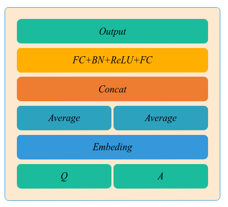
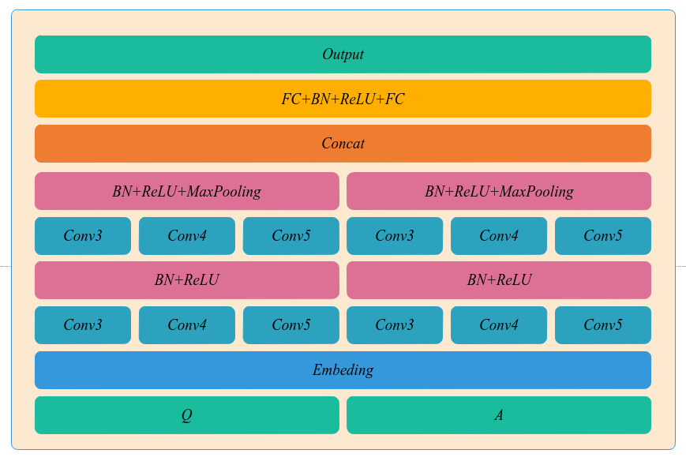

# 智能阅读模型

## 概述
总体分为两部分：第一部分关键词匹配，第二部分精准匹配，最后选择置信度最高的正确回答。

第一部分可使用 TF-IDF、LSI 等传统方法。

第二部分可使用 基于深度学习的问答系统。

本文主要构建第二部分，第一部分可参考：https://github.com/Inch-Z/doc-similarity

## 下载数据

1. http://www.tipdm.org/jingsa/1253.jhtml  
train_data_complete.json、test_data_sample.json、submit_sample.txt => main/data 文件夹

2. https://spaces.ac.cn/archives/4338  
me_train.json => generalization/data 文件夹

## 运行项目
```
$ ......
1. word2vec/step.ipynb -> 
  word2vec/word2vec.ipynb
2. main/data/data.ipynb -> 
  main/data/1xxxxxx.ipynb 
  main/data/2xxxxxx.ipynb 
  main/data/3xxxxxx.ipynb 
  main/data/4xxxxxx.ipynb 
  main/data/5xxxxxx.ipynb 
  -> main/evaluate.ipynb
3. test/data/newdata.ipynb -> 
  test/data/data.ipynb -> 
  test/predict.ipynb -> 
  test/evaluate.ipynb

$ tree
.
├── word2vec
│   ├── step.ipynb
│   └── word2vec.ipynb
├── main
│   ├── data
│   │   └── data.ipynb
│   ├── 1_FastText.ipynb
│   ├── 2_CNN1.ipynb
│   ├── 3_CNN2.ipynb
│   ├── 4_BiLSTM.ipynb
│   ├── 5_Attention.ipynb
│   └── evaluate.ipynb
└── test
    ├── data
    │   ├── data.ipynb
    │   └── newdata.ipynb
    ├── evaluate.ipynb
    └─── predict.ipynb
```

## 模型设计
1. FastText



2. CNN



3. Bi-LSTM


4. Attention


